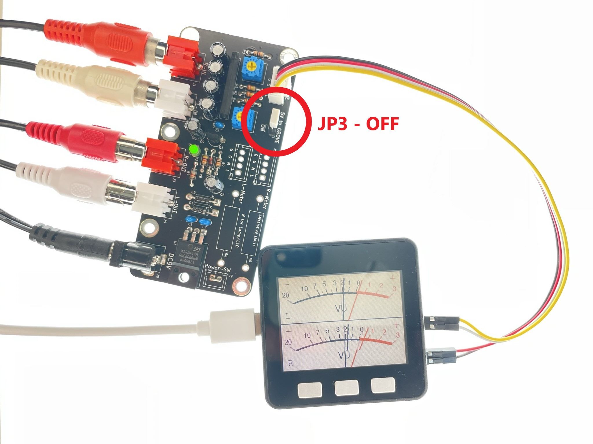
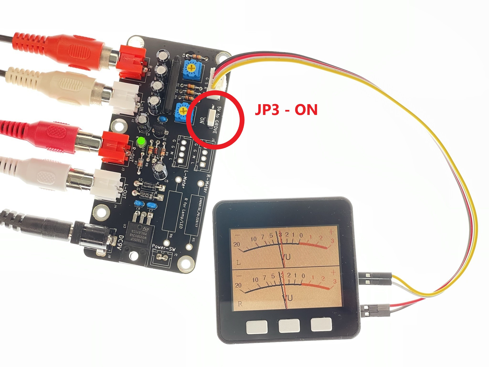
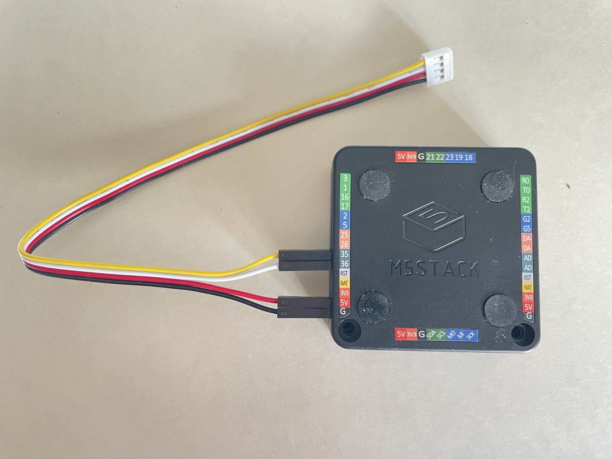
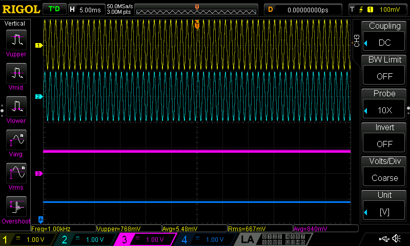
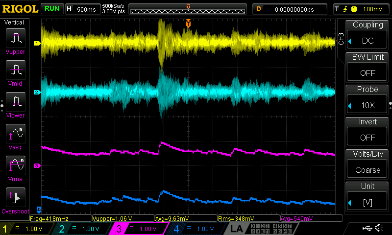
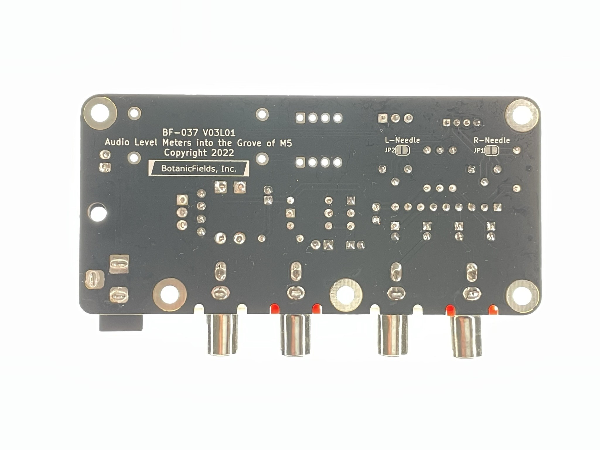

# PCB-Grove-VU-Meter
VU Meters into the Grove of M5

# オーディオレベルメーター用Grove(M5)接続基板
　ステレオオーディオ信号を、レベルメーター用のアナログ電圧信号に変換するプリント基板です。アナログ信号2本とM5Stack用の5V電源を、Groveコネクタから出力します。M5StackのLCDにVUメーターのように表示するサンプルプログラムを用意しています。

### サンプルプログラムの動作不良について
(2023/5/6) BF-037.inoは、以下の環境でコンパイルできました。しかしばがら、ADCによるオーディオ信号の取り込みが安定せず、使用に耐えない状況です。
- Arduino IDE 2.1.0
- Boards Manager:  
M5Stack by M5Stack official 2.0.7
- Library:  
M5Stack by M5Stack 0.4.3  
M5GFX 0.1.6

[内容物]  

動作例（YouTube）: [Audio level (VU/McIntosh) meters into the Grove of M5Stack](https://youtu.be/Pwd8X57_v_Q)

委託販売（スイッチサイエンス）:  [オーディオレベルメーター用Grove(M5)接続基板](https://www.switch-science.com/catalog/7947/)

## 安全上の注意事項
- 異常の場合、躊躇なくDCプラグを抜いてください（基板上のレギュレータ(U3)が触れないぐらい発熱しているなど）。その上で原因を取り除いてください。
- Groveへの5V出力は、必要な場合以外は、ジャンパピンJP3で切り離してください。特に電源が3.3Vの装置に5Vを供給すると焼損など事故の原因となります。
- 本基板からの5VとM5Stack側からの5Vは共存できません。僅かな電圧差から大電流が流れ、素子の発熱による火傷や、M5Stackの故障の原因になります。
- M5StackへのUSB-C以外の5V電源供給は推奨されていません。本基板の機能を含め、M5Stackへの直接の5V供給は自己責任です。

## 特徴
- オーディオ信号を整流し対数圧縮する専用LSI(ROHM BA6138)を使用しています。
- 基板上の半固定抵抗でフルスケールを調整できます。
- M5Stackの標準ボトムのピンソケットに接続するためのケーブルを添付しています。
- M5Stackへ5V電源を供給でき、スタンドアロン動作ができます。
- 左右2系統のRCAピンジャックが各々2個(In, Out)あり、RCAケーブルを中継できます。

## 注意事項
- 本基板は測定器ではありません。PCオーディオなどの手軽なオーディオ環境で見た目を楽しむための小物（ガジェット、ウィジェット、アクセサリ）です。サンプルプログラムの目盛も全くの飾りです。  
- BA6138は入力抵抗も2kΩ程度と低く、音質への影響は小さくないものと思われます。

## Groveコネクタへの5V電源供給のON/OFF
　本基板のジャンパピンJP3でGroveコネクタへの5V供給のON/OFFを設定します。JP3の切替は、DCプラグを抜いて実施ください。出荷時はOFFです。

| JP3 | Grove 5Vピン | M5Stackの電源 | 用途 |
|:-:|:- |:- |:- |
| OFF | 接続なし | USB-C、またはバッテリから供給(*1) | プログラム書き込み、シリアルモニターの利用など |
| ON  | 5Vを供給 | 本基板から供給(*2) | M5Stackをスタンドアロンで使用など |

(*1) JP3をOFFに設定してから、本基板のDCプラグを差し込んでください。  
(*2) JP3をONに設定する際は、USB-Cケーブルを取り外し、M5Stackを電源OFFとしてから、本基板のDCプラグを差し込んでください。バッテリ動作中のM5Stackは、電源/リセットボタンを2回押すことで電源OFFにできます。

[USB-C接続あり]  

[Groveから電源供給]  

## 仕様
- 外形寸法: 92x44mm
- 電源入力: DCジャック（DC 9V）
- 信号入力: RCAピンジャック（L/R, オーディオラインレベル）
- 信号出力: Groveコネクタ（アナログ2本）
- 電源出力: Groveコネクタ（DC 5V）

## 内容物
- プリント基板（完成品）
- Grove-4ピン-ジャンパオスケーブル [SEEED-110990210](https://www.switch-science.com/catalog/6245/)　※5本入のうちの１本です
- 説明書

## 使用方法
- 電源（ACアダプタ等）は添付しません。別途ご用意ください。  
例：秋月電子通商　スイッチングＡＣアダプター　９Ｖ１．３Ａ [AD-B90P130](https://akizukidenshi.com/catalog/g/gM-11998/)
- 電源スイッチはありません。入力や出力を接続し、設定を確かめてからDCプラグを差し込んでください。
- RCAジャックは2系統（赤・白）あり、各々2個が並列になっています。便宜上、基板シルクにはIN, OUTと表示しています。
- Groveの出力信号はアナログ電圧です。M5StackのPort A(I2C)には接続できません。M5Stackのボトムの端子に接続してください。

[サンプルプログラム使用時のM5Stackへの接続]  

|Grove|M5Stack|
|:-:|:-:|
|L  |GPIO35|
|R  |GPIO36|
|5V |5V |
|GND|GND|

- 基板上の半固定抵抗は、ご使用の環境で再調整ください。調整には小型のプラスドライバが必要です。

### 出荷時の調整の環境
- Windows11
- USB DAC: Sound Blaster Digital Music Premium HD(SB1240) [製品情報](https://jp.creative.com/p/sound-blaster/sound-blaster-digital-music-premium-hd)  
※安定動作のためには、Windows10 64bit用ドライバーの適用が有効な様です。[ドライバーダウンロード](https://jp.creative.com/support/downloads/download.asp?MainCategory=1091&nRegionFK=&nCountryFK=&nLanguageFK=&sOSName=&region=2&Product_Name=Sound+Blaster+Digital+Music+Premium+HD&Product_ID=19829&modelnumber=&driverlang=1041&OS=52&drivertype=0)
- YouTube Music: Audiolab 2014: Audio Test Tones: [1kHz 0dB](https://music.youtube.com/watch?v=_XMpb9BjGgE&feature=share)
- VUメーターが-5VUを示す様に調整（一般音源のメーターの振れが適当になる位置）

[入力信号-3dB(L/R)に対する出力(L/R)の例]  

[音楽信号入力(L/R)に対する出力(L/R)の例]  

## ご参考
- ROHM BA6138  
aitendo扱い レベルメーターアンプ [BA6138](https://www.aitendo.com/product/11726)
データシート[BA6138](http://aitendo3.sakura.ne.jp/aitendo_data/product_img/ic/audio/BA6138/BA6138.pdf)
- 基板上の、以下の部品等は未使用です。  
J5, J6, J9（短絡済）, JP1, JP2, R5, R6

[基板裏面]  

