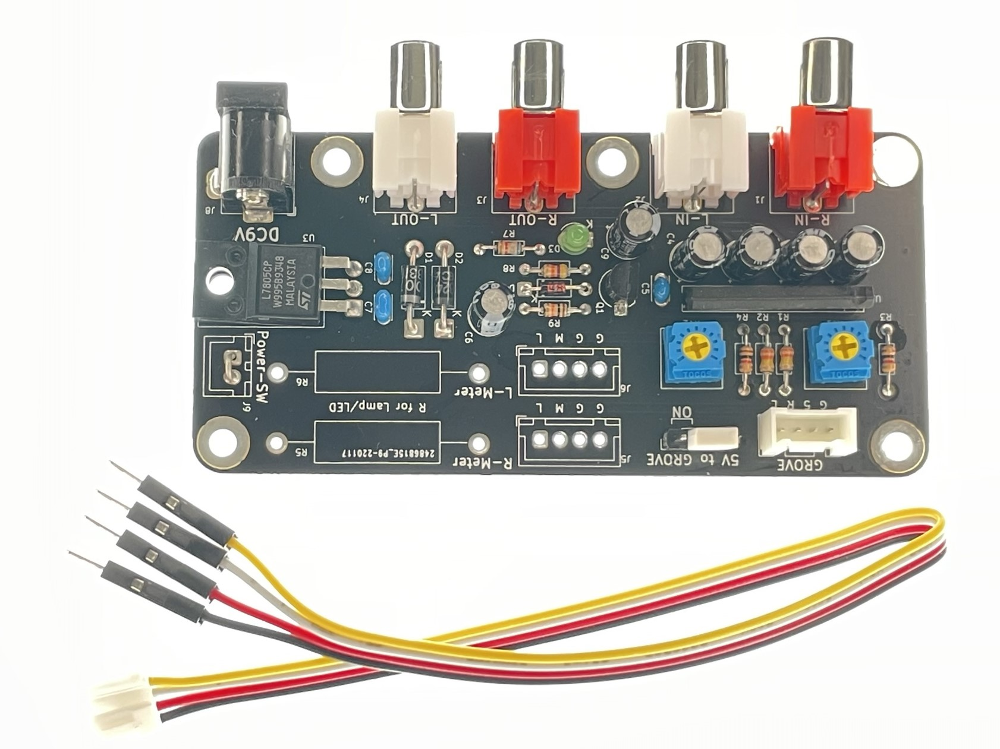

# PCB-Grove-VU-Meter
VU Meters into the Grove of M5

# オーディオレベルメーター用Grove(M5)接続基板
ステレオオーディオ信号をレベルメーター用のアナログ電圧信号に変換するプリント基板です。アナログ信号2本とM5Stack用の5V電源をGroveコネクタから出力します。M5StackのLCDにVUメーターのように表示するサンプルプログラムを用意しています。

[内容物]  

動作例（YouTube）: [Audio level (VU/McIntosh) meters into the Grove of M5Stack](https://youtu.be/Pwd8X57_v_Q)

委託販売（スイッチサイエンス）:  [オーディオレベルメーター用Grove(M5)接続基板](https://www.switch-science.com/catalog/xxxx/)

## 特徴
- オーディオ信号を整流し対数圧縮する専用LSI(BA6138)を使用しています。
- 基板上の半固定抵抗でフルスケールを調整できます。
- M5StackのGPIOに接続するためのケーブルを添付しています。
- M5Stackへ5V電源を供給できます。
- 左右2系統のRCAピンジャックが各々2個(In, Out)あり、RCAケーブルを中継できます。

※本基板は測定器ではありません。PCオーディオなどのお手軽なオーディオ環境で見た目を楽しむための小物（ガジェット、ウィジェット、アクセサリ）です。サンプルプログラムの目盛も全くの飾りです。  
※使用したBA6138は入力抵抗も2kΩ程度と低く、音質への影響は小さくないものと思われます。

## 安全上の注意事項
- M5StackへのM-BUS直接の5V電源供給は推奨されておらず自己責任とされています。 M5Stack側の5Vと本基板からの5Vが競合すると、僅かな電圧差から大電流が流れ、素子の発熱による火傷や、M5Stackの故障の原因になります。
- 基板上のレギュレータ(U3)が触れないぐらい発熱したなど異常の場合、躊躇なくDCプラグを抜いてください。その上で原因を取り除いてください。
- 基板上のジャンパピンJP3により、Groveコネクタへの5V供給のON/OFFを適切に切り替えてください。JP3の切替は、DCプラグを抜いて実施ください。出荷時はOFFです。
- M5Stackへのプログラムの書き込みやシリアルでのモニタリングにはUSB-Cを接続する必要があります。この場合、本基板からの5V供給を止めて(OFF)から、DCプラグを差し込んでください。
- 本基板から5Vを供給(ON)する場合は、USB-Cケーブルを取り外し、M5Stackを電源OFFとしてから、DCプラグを差し込んでください。バッテリ動作中のM5Stackは、電源/リセットボタンを2回押すことで電源OFFにできます。
- Groveへの5V出力は、必要な場合以外はジャンパピンJP3で切り離して(OFF)ください。特に電源が3.3Vの装置を接続すると、焼損などの致命的な事故の原因となります。

[USB-C接続あり]  

[Groveから電源供給]  

## 仕様
- 外形寸法: 92x44mm
- 電源入力: DC 9V、DCジャックから供給
- 信号入力: RCAピンジャック（2系統）オーディオラインレベル
- 信号出力: Groveコネクタ（アナログ2本）
- 電源出力: DC 5V、Groveコネクタ

## 内容物
- プリント基板（完成品）
- Grove-4ピン-ジャンパオスケーブル [SEEED-110990210](https://www.switch-science.com/catalog/6245/)　※5本入のうちの１本です
- 説明書

## 使用方法
- 電源（ACアダプタ等）は添付しません。別途ご用意ください。  
例：秋月電子通商　スイッチングＡＣアダプター　９Ｖ１．３Ａ [AD-B90P130](https://akizukidenshi.com/catalog/g/gM-11998/)
- 電源スイッチはありません。入力や出力を接続し、設定を確かめてからDCプラグを差し込んでください。
- RCAジャックは2系統（赤・白）あり、各々2個が並列になっています。便宜上、基板シルクにはIN, OUTと表示しています。
- Groveの出力信号はアナログ電圧です。M5StackのPort A(I2C)には接続できません。M5Stackのボトムの端子に接続してください。

[サンプルプログラム使用時のM5Stackへの接続]  

|Grove|M5Stack|
|:-:|:-:|
|L  |GPIO35|
|R  |GPIO36|
|5V |5V |
|GND|GND|

- 基板上の半固定抵抗は、ご利用の環境で再調整をお願いします。調整には小型のプラスドライバが必要です。

### 出荷時の調整の環境
- Windows11
- USB DAC: Sound Blaster Digital Music Premium HD(SB1240)
- YouTube Music: Soft Hearts LLC Audio Test Tones 2021: Audio Test Tone 20k-20Hz -3dBFS
- VUメーターが-3VUを示す様に調整

[入力信号-3dB(L/R)に対する出力(L/R)の例]  

[音楽信号入力(L/R)に対する出力(L/R)の例]  

## ご参考
- ROHM BA6138  
aitendo扱い レベルメーターアンプ [BA6138](https://www.aitendo.com/product/11726)
データシート[BA6138](http://aitendo3.sakura.ne.jp/aitendo_data/product_img/ic/audio/BA6138/BA6138.pdf)
- 基板上の、以下の部品等は未使用です。  
J5, J6, J9（短絡済）, JP1, JP2, R5, R6

[基板裏面]  

